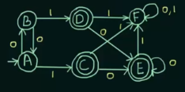

## Minimizar Automatos Finítos Determinísticos Reduzidos

### Pré-requisitos
* python3
### Observações
* Considerar os colchetes '[ ]' como sendo o símbolo para representar um conjunto, visto que este é representado com chaves '{ }'.
* Por exemplo: seguindo a observação acima, o conjunto vazio será representado por [ ] .
### Executar
Basta executar `$ python3 main.py nome_do_arquivo.txt`

Onde o arquivo "nome_do_arquivo.txt" deve seguir o seguinte formato para o autômato representado
pelo diagrama de transições a seguir:

o nome_do_arquivo.txt terá de seguir o seguinte formato:

	'a','b','c','d','e','f'
	01
	'b','c'
	'a','d'
	'e','f'
	'e','f'
	'e','f'
	'f','f'
	'a'
	'c','d','e'

Onde a

**Primeira linha:** Indica o nome dos estados  
**Segunda linha:** Indica o alfabeto  
**Terceira, quarta, quinta, sexta, sétima e oitava linha:** Indicando a matriz delta considerando a primeira coluna como a transição após a leitura do primeiro símbolo em diante  
**Obs**: Considerando que este autômato possui seis estados, a matriz terá seis linhas, logo, as duas últimas linhas sempre serão estado inicial e estado final, respectivamente.  
**Nona linha:**  Indica o estado inicial  
**Décima linha:**  Indica os estados finais  

Nesta pasta contém três automatos([Automato 1](automato1.txt), [Automato 2](automato2.txt) e [Automato 3](automato3.txt)) no formato apresentado acima.
O [Automato 1](automato1.txt) é o exemplo do diagrama mostrado acima.  
Ao executar `$ python3 main.py automato1.txt`  
A saída do programa será: 

	Estados:
	["['c', 'd', 'e']", "['a', 'b']", "['f']"]

	Sigma:
	['0', '1']

	Delta:
	["['c', 'd', 'e']", "['f']"]
	["['a', 'b']", "['c', 'd', 'e']"]
	["['f']", "['f']"]

	Estado inicial:
	['a', 'b']

	Estados finais:
	["['c', 'd', 'e']"]

Este ainda perguntará se você deseja sair/parar a execução ou testar alguma palavra que o autômato; feito isso o programa retorna se a palavra inserida é reconhecida ou não.